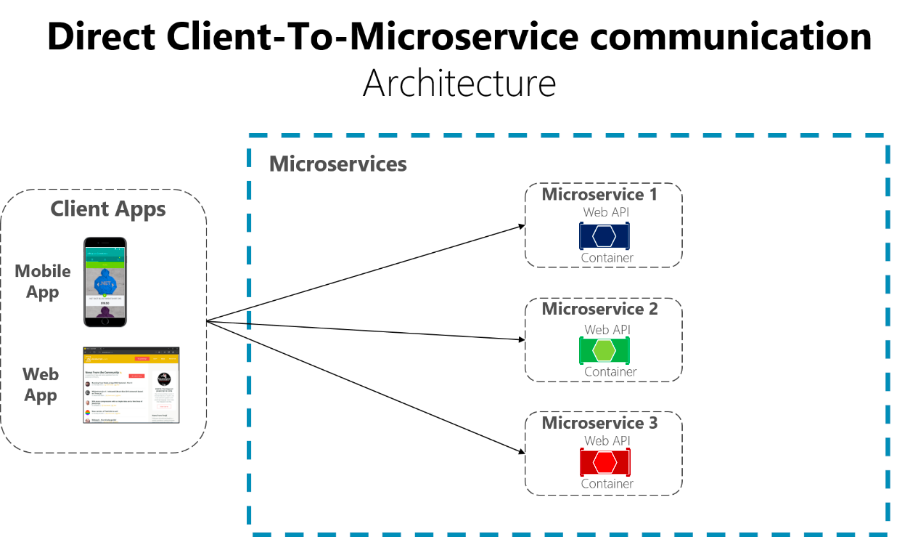

# 마이크로 서비스 어플리케이션 구축기 (Feat.스프링클라우드)


마이크로 서비스들은 discovery service 에 등록되고 삭제될 것임


### Restful Web Service

- Use plurals
  - prefer users/1 to user/1

### Spring Cloud

스프링 클라우드를 이용하면, 환경설정이나 서비스 검색, 라우팅 등의 분산 시스템 환경을 쉽게 구축할 수 있다.

스프링 클라우드의 프로젝트에는 아래와 같은 것들이 있는데, 이 중 이 프로젝트에서 사용해볼 것은 체크표시를 했다.

- Spring Cloud Config ✅
- Spring Cloud Netflix ✅
- Spring Cloud CLI 
- Spring Cloud Starters  ✅
- Spring Cloud Gateway  ✅
- Spring Cloud Security ✅
- Spring Coud Sleuth ✅
- Spring Coud OpenFeign ✅
- Spring Coud Zookeeper
- Spring Cloud Task
- etc...

## *<u>Service Discovery</u>*

```java
@SpringBootApplication
@EnableEurekaServer
public class DiscoveryserviceApplication {

    public static void main(String[] args) {
        SpringApplication.run(DiscoveryserviceApplication.class, args);
    }

}
```

만들어진 모든 마이크로 서비스들은 Spring Cloud Netflix Eureka 서버에 등록된다.
이렇게 Eureka 가 해주는 역할을 Service Discovery 라고 한다.

서비스들을 등록하고, 검색이 가능하게 해주는 기능을 Service Discovery 라 하며,
이 기능을 하는 제품으로 넷플릭스 유레카를 사용하였다.

의존성
- Spring Cloud Discovery > 


## *<u>User Service</u>*

```java
@SpringBootApplication
@EnableDiscoveryClient
public class UserServiceApplication {

    public static void main(String[] args) {
        SpringApplication.run(UserServiceApplication.class, args);
    }

}
```

user-service 를 등록했다.

`192.168.0.24:user-service:9001`

user service 인스턴스를 하나 더 등록해보자!
Edit Configuration 에 보면 어플리케이션 copy 하여 실행할 수 있음


또는 터미널 명령으로 프로그램 실행 가능.

>  mvn spring-boot:run -Dspring-boot.run.jvmArguments='-Dserver.port=9003'

터미널에서 실행하는게 더 간편하긴 하다.

**java -jar 로 실행하는 법**
$ mvn clean
$ mvn compile package
$ java -jar -Dserver.port=9004 ./target/user-service-0.0.1-SNAPSHOT.jar


## <u>_API Gateway Service_</u>
왜 필요한가?



### dependency
- spring gateway

클라이언트에서 마이크로 서비스 호출시, 직접적인 마이크로 서비스의 주소를 클라이언트가 참조하게 되면,
마이크로 서비스의 인스턴스 정보(주소)가 바뀌었을 때 클라이언트 단에서도 변경이 필요하게 되는 단점을 해결하기 위헤 api gateway 를 사용한다.
클라이언트 - apigateway - 마이크로 서비스
이런 구조를 가짐으로써, 변화에 유연한 대처를 할 수 있게 된다.
또한 인증, 권한에 대한 단일작업을 할 수 있으며 부하분산 등을 쉽게 할 수 있다.

- API Gateway Service
- Netflix Ribbon 과 Zuul
- Spring Cloud Gateway (Filter, Eureka(discovery service) 연동, Load Balancer)

### 스프링 클라우드에서 msa 간통신
- RestTemplate
- FeignClient

### gateway 에 Filter 추가하기


